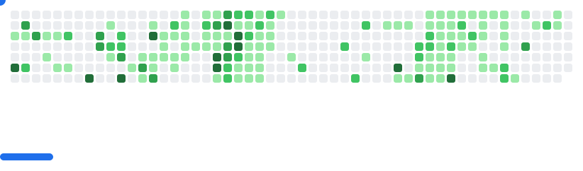

<!-- =====================================================
  GitHub Profile README
  Name   : Nurul Shaikh
  GitHub : Dev-Nurul08
  Style  : Dark • Neon • Clean • Modern
===================================================== -->

<!-- HEADER OPTION 2 : SPLIT NEON BAR -->

## 👋 About Me

👨‍🎓 Diploma in Computer Engineering 

🏫 Red & White Multimedia Education

💻 C → HTML → CSS → JavaScript → Full Stack

🎯 Goal: Become an industry-ready developer

I focus on daily improvement, not shortcuts.

<h2>🤔🤔2025 Git Wrapped</h2>

<video width="320" height="240" controls>
  <source src="https://git-wrapped.com/profiles/Dev-Nurul08" type="video/mp4">
</video>

<!-- Tech Stack Section -->
<h2 align="center">🚀 My Tech Stack</h2>

  <i>Tools, languages & technologies I work with</i>

---

### 🧠 Programming Languages

  
  

  
  
  
  
 

---

### 🌐 Frontend Development

  
  
  
  
  
  

---

### 🎨 UI Frameworks & Styling

  
  
  

---

### ⚙️ Backend & Tools

  
  
  
  
  

---

### 🗄️ Databases

  
  
  

---

### 🎨 Design & Creativity

  
  
  
  

---

  
Click to see a random joke

  

  

  

  ⭐ <b>Always learning. Always building.</b> ⭐

# 📊 GitHub Stats:
 
 

## 🏆 GitHub Trophies

### ✍️ Random Dev Quote

### 🔝 Top Contributed Repo

---

<!-- Proudly created with GPRM ( https://gprm.itsvg.in ) --> 

<picture>
  <source
    media="(prefers-color-scheme: dark)"
    srcset="images/breakout-dark.svg"
  />
  <source
    media="(prefers-color-scheme: light)"
    srcset="images/breakout-light.svg"
  />
  
</picture>
